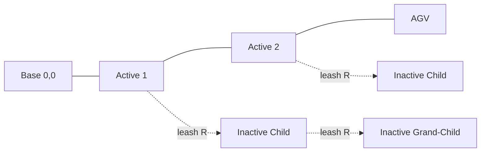
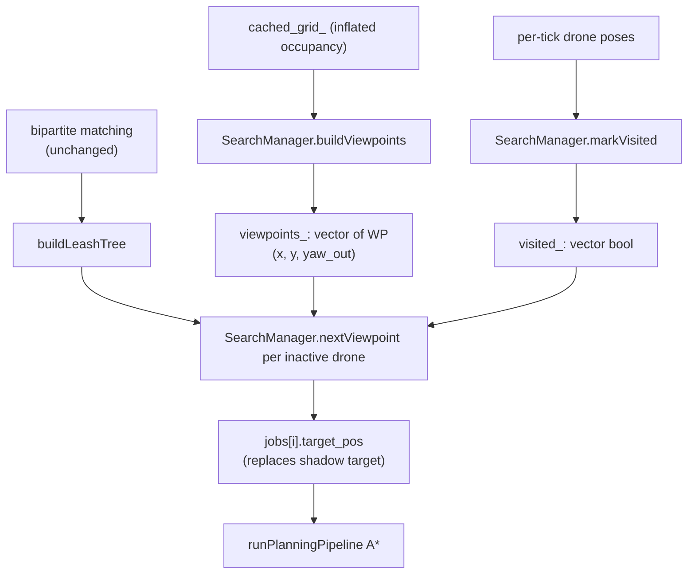

# Plan: Obstacle-Viewpoint Search via Leashed Inactive Drones

## Goal

ArUco markers sit on the walls of obstacles. The OctoMap tells us where every obstacle is. Today, inactive drones just "shadow" the nearest chain anchor ([move.cpp:961-985](workspace/src/graph_traversal/src/move.cpp)) — pure dead weight for marker discovery. Replace that shadow logic with an **obstacle-viewpoint search** so every inactive drone actively inspects a wall it has not yet seen, while still respecting the LOS / comm-range constraint.

## Concept



- **Active** = matched to a BFS chain anchor (unchanged).
- **Inactive** = unmatched. Each is leashed (`<= comm_range`) to the **nearest already-connected drone**. That parent may itself be inactive, so two inactive drones can extend a sub-chain off an active drone (up to `2 R` from the chain). A hard cap (`max_inactive_chain_depth`, default = 2) prevents the sub-chain from going deeper than that — a 4-deep chain has 4 fragile LOS hops and the coverage gain is diminishing.
- Each inactive drone's target = best **unvisited obstacle viewpoint** inside the disk centered on its parent's planned position with radius `comm_range - margin`.

## Architecture



## Files to change

- **[workspace/src/graph_traversal/src/move.cpp](workspace/src/graph_traversal/src/move.cpp)** — primary changes (new struct + replace the shadow branch in `handleMission`).
- **[workspace/src/graph_traversal/README.md](workspace/src/graph_traversal/README.md)** — short subsection describing the new `SearchManager` and the leash tree.

No changes to `bfs.cpp`, `aruco_mission_node.cpp`, message types, or launch files.

## Component design

### 1. `SearchManager` (new struct inside `move.cpp`)

```cpp
struct Viewpoint {
  double x, y;       // world (m)
  double yaw_out;    // facing away from obstacle wall (rad)
};

class SearchManager {
public:
  // Build once after grid is cached. Scans inflated grid: a viewpoint is a
  // FREE cell (data < 50) that has at least one OCCUPIED 4-neighbor. yaw_out
  // = atan2 of the mean outward vector from those neighbors.
  void buildViewpoints(const nav_msgs::msg::OccupancyGrid& grid);

  // Called per drone per tick. Marks visited any viewpoint within
  // visit_radius_ AND whose yaw_out is roughly opposite to drone-to-VP
  // (drone is on the "viewing side" of the wall).
  void markVisited(double x, double y);

  // Pick the closest unvisited viewpoint inside disk(cx, cy, leash_r) that
  // is also <= search_radius from (drone_x, drone_y) so the drone doesn't
  // get a target on the far side of the leash. Returns false if none.
  bool nextViewpoint(double cx, double cy, double leash_r,
                     double drone_x, double drone_y,
                     Viewpoint& out);

private:
  std::vector<Viewpoint> viewpoints_;
  std::vector<bool> visited_;
  // Grid-cell -> indices into viewpoints_, for O(1) markVisited lookup
  std::unordered_map<int, std::vector<int>> grid_index_;
  double visit_radius_ = 1.5;   // m
  double res_, ox_, oy_;
  int w_, h_;
};
```

- `buildViewpoints` runs **once**, called at the end of `fetchOctomapOnce()` ([move.cpp:309-326](workspace/src/graph_traversal/src/move.cpp)).
- `markVisited` is cheap (hash lookup + small loop) and called for every drone in `runSwarmSystem` before matching, so the viewpoint set monotonically shrinks.
- Wrap all state with `data_mutex_` (already present).

### 2. Leash tree (new helper in `move.cpp`)

```cpp
struct LeashNode {
  std::string id;
  geometry_msgs::msg::Point pos;     // current pos (for distance)
  geometry_msgs::msg::Point target;  // chosen target_pos (parent for grand-children)
  int parent = -1;                    // -1 = active root
};

// Build BFS-style: start with active drones (target = chain anchor, depth=0),
// then iteratively connect each remaining inactive drone to the NEAREST
// already-connected drone whose comm distance is <= comm_range AND whose
// depth < max_inactive_chain_depth_. Inactive drones with no eligible
// parent (out of range OR parent would exceed depth cap) fall through to
// the legacy shadow target.
//
// Depth field on LeashNode:
//   depth = 0   for every active drone (root)
//   depth = parent.depth + 1   for inactive drones
//
// Hard cap: max_inactive_chain_depth_ (ROS param, default = 2).
// With cap=2: an inactive can hang off an active (depth=1), OR off another
// inactive that's hanging off an active (depth=2). A third level (depth=3)
// is rejected — the candidate parent at depth=2 is skipped and we look for
// the next-nearest connected drone with depth < 2.
std::vector<LeashNode> buildLeashTree(...);
```

**Why a cap?** Without one, 4 inactive drones in a worst-case sparse-active scenario could form a `1 → 2 → 3 → 4` chain at `4R` from the active root. Every extra link is one more LOS hop that can break from a single drone glitch, and the marginal coverage gain past 2 hops is small because A* still has to route through obstacles. Cap = 2 keeps the sub-chain robust while still giving up to `2R` reach.

### 3. `handleMission` changes ([move.cpp:961-985](workspace/src/graph_traversal/src/move.cpp))

Replace the `IDLE DRONE (SHADOW STRATEGY)` branch:

```cpp
} else {
  // --- INACTIVE DRONE (LEASHED OBSTACLE SEARCH) ---
  jobs[global_idx].is_assigned = false;
  jobs[global_idx].target_z = z_mission;

  // Look up this drone in the leash tree built earlier this tick
  const LeashNode& node = leash_tree[id_to_node[id]];
  if (node.parent >= 0) {
    Viewpoint vp;
    bool ok = searchMgr_.nextViewpoint(
        leash_tree[node.parent].target.x,
        leash_tree[node.parent].target.y,
        get_comm_range() - 1.0,           // safety margin
        current_pos.x, current_pos.y,
        vp);
    if (ok) {
      jobs[global_idx].target_pos.x = vp.x;
      jobs[global_idx].target_pos.y = vp.y;
      jobs[global_idx].target_pos.z = z_mission;
      // Override final-waypoint yaw later in the cmd build so the drone
      // looks AT the wall, not in travel direction.
      jobs[global_idx].search_yaw = vp.yaw_out + M_PI;
      jobs[global_idx].has_search_yaw = true;
      continue;
    }
  }

  // Fallback: existing shadow logic (unchanged) when no parent OR no
  // unvisited viewpoint inside leash.
  /* … original shadow code … */
}
```

Then in the per-drone command build ([move.cpp:1076-1119](workspace/src/graph_traversal/src/move.cpp)), if `job.has_search_yaw`, overwrite the final `cmd.yaw` so the drone actually looks at the wall.

### 4. Per-tick visit marking

At the very top of `handleMission` (after the pose snapshot), call:

```cpp
for (auto& [id, pose] : local_poses) {
  searchMgr_.markVisited(pose.pose.position.x, pose.pose.position.y);
}
```

### 5. Order of operations in `handleMission`

1. Snapshot grid / targets / poses (unchanged).
2. `searchMgr_.markVisited(...)` for every drone.
3. BMS classification + smart recall (unchanged).
4. Bipartite matching (unchanged) → active vs inactive split.
5. **NEW**: `buildLeashTree(active_drones, inactive_drones, local_poses, anchors, comm_range)`.
6. Build `jobs[]`: active branch unchanged; inactive branch uses `SearchManager.nextViewpoint` (new code above), fallback to shadow.
7. A* planning + atomic commit (unchanged).

## Tuning knobs (declare as ROS params)

- `visit_radius` = 1.5 m
- `leash_margin` = 1.0 m subtracted from `comm_range` so we don't sit exactly on the LOS edge.
- `viewpoint_distance` = 1 cell (currently implicit — the FREE cell adjacent to an occupied cell). Easy to expand to "2-3 cells outward" later if cameras need standoff.
- `max_inactive_chain_depth` = 2 (depth cap on the inactive sub-chain; 1 = no inactive-of-inactive, 2 = at most one grand-child, etc.).

## Out of scope (saved for v2 per your earlier choice)

- Active-drone wiggle toward nearby unvisited viewpoints.
- Multi-altitude viewpoints (today we use the current chain `z_mission`).
- Using the ArUco node's detections to retroactively mark viewpoints visited.

## Test plan

- Drop into existing sim, watch `RCLCPP_INFO` for "viewpoints built: N" + per-drone "search target chosen (vp=…)" lines.
- Confirm with `rviz2` that inactive drones drift toward walls instead of hovering 2 m off a chain anchor.
- Confirm `/target_found` rate goes up vs. baseline run (more markers discovered earlier).
- Stress: 5 drones, 1 chain link of length 2 → at least 3 inactive children should form a 2-deep sub-chain when an obstacle cluster is `> comm_range` from any active drone.
